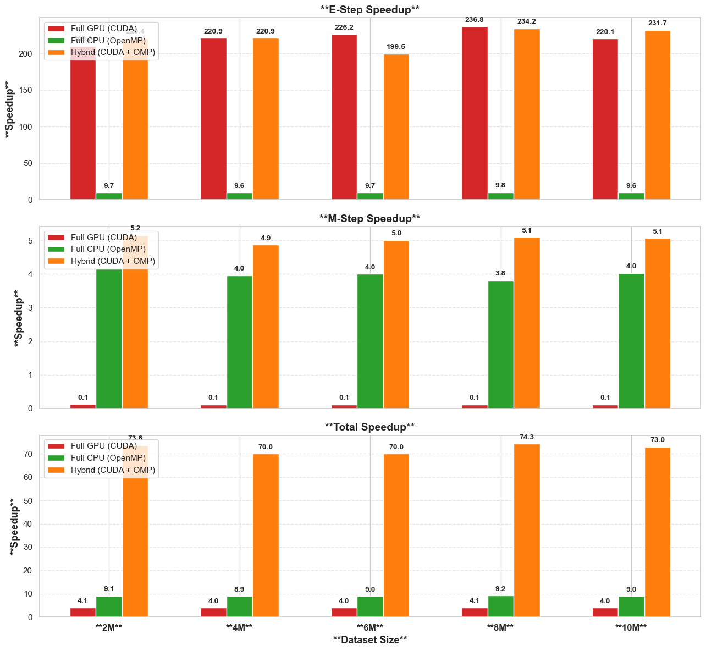
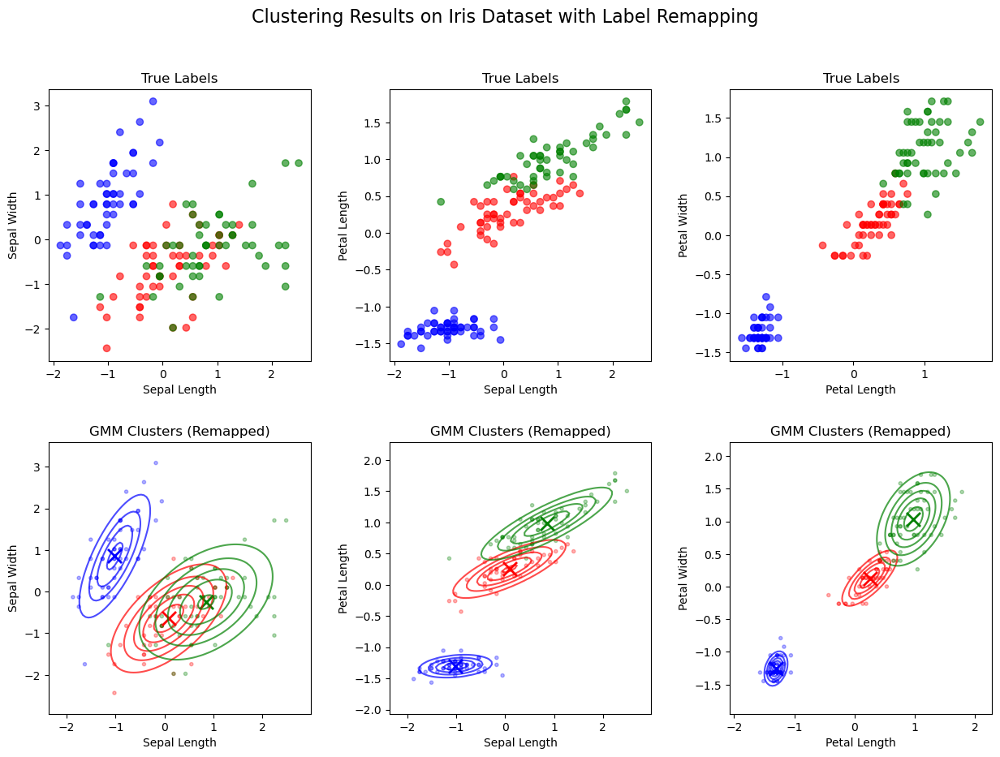

# Hybrid GPU-CPU Expectation-Maximization for Gaussian Mixture Models

A high-performance implementation of the Expectation-Maximization (EM) algorithm for Gaussian Mixture Models (GMMs) that combines GPU acceleration via CUDA with CPU parallelization using OpenMP.

## Overview

This project implements a numerically stable and highly optimized EM algorithm that achieves significant speedups over traditional CPU-only implementations. The hybrid approach leverages the computational power of GPUs for the E-step while utilizing CPU parallelization for the M-step, balancing performance with memory transfer overhead.

## Key Features

- **Hybrid GPU-CPU Architecture**: GPU-accelerated E-step with CPU-parallelized M-step
- **Numerical Stability**: Log-space computations with log-sum-exp trick to prevent underflow
- **Adaptive Regularization**: Automatic covariance matrix regularization for numerical stability
- **K-means++ Initialization**: Smart initialization for better convergence
- **Comprehensive Timing**: Detailed performance monitoring and analysis
- **Error Recovery**: Robust error handling with fallback strategies
- **Multiple Backends**: Support for both CUDA and CPU-only execution

## Performance

- **73× speedup** over sequential implementations
- **8-9× speedup** compared to pure CPU parallel implementations
- **4× speedup** compared to pure GPU implementations
- Scales efficiently with dataset size and dimensionality

## Requirements

### Hardware
- NVIDIA GPU with CUDA Compute Capability 3.5+
- Multi-core CPU for OpenMP parallelization

### Software
- CUDA Toolkit 10.0+
- GCC/G++ with C++11 support
- OpenMP
- Eigen 3.4.0+ (included in project)

### Dependencies
```bash
# Ubuntu/Debian
sudo apt-get install build-essential nvidia-cuda-toolkit

# CentOS/RHEL
sudo yum install gcc-c++ cuda-toolkit
```

## Installation

1. **Clone the repository**:
```bash
git clone <repository-url>
cd ExpectationMaximization
```

2. **Set up Eigen** (if not already included):
```bash
# Eigen is included in the project structure
# Verify path: ../../eigen-3.4.0/Eigen/Dense
```

3. **Compile the code**:
```bash
nvcc -O3 -std=c++11 -fopenmp ExpectationMaximization.cu -o gmm_cuda -leigen3
```

## Usage

### Basic Usage

```bash
# Ensure your data files are in the correct location
mkdir -p datasets timing_results convergence_data

# Place your data files:
# - datasets/gmm_data.csv (features)
# - datasets/gmm_labels.csv (optional ground truth labels)

# Run the GMM fitting
./gmm_cuda
```

### Data Format

**gmm_data.csv**: CSV file with numerical features (no header expected)
```csv
-1.5,2.3
0.8,-1.2
2.1,3.4
...
```

**gmm_labels.csv**: CSV file with integer cluster labels (header expected)
```csv
label
0
1
0
...
```

### Configuration

Modify the main function to adjust parameters:

```cpp
// Number of components (auto-detected from labels or set to 3)
int true_components = 4;

// Create GMM with custom parameters
GaussianMixtureModel gmm(
    true_components,  // Number of components
    10000,           // Maximum iterations
    1e-6,           // Convergence tolerance
    true            // Use CUDA (false for CPU-only)
);
```

## Algorithm Details

### E-Step (GPU-Accelerated)
- Computes log-probabilities using CUDA kernels
- Applies log-sum-exp trick for numerical stability
- Calculates responsibilities for each data point

### M-Step (CPU-Parallelized)
- Updates component weights, means, and covariances
- Uses OpenMP for parallel computation
- Applies adaptive regularization for numerical stability

### Key Optimizations
- **Log-space computations**: Prevents numerical underflow
- **Shared memory usage**: Reduces global memory access
- **Coalesced memory access**: Optimizes GPU memory bandwidth
- **Adaptive regularization**: Maintains positive definiteness

## Experimental Results

### Performance Evaluation on Synthetic Data

We evaluated our hybrid implementation on synthetic datasets of varying sizes (2M, 4M, 6M, 8M, and 10M data points) with 5 clusters and 10-dimensional data.

#### Execution Times and Speedups




**Key Findings:**
- **E-step Performance**: GPU implementation achieves ~220-234× speedup over sequential, while CPU parallelization achieves only ~9.8×
- **M-step Performance**: CPU parallelization shows ~4.0× speedup, while GPU performs poorly (~0.1×) due to synchronization overhead
- **Overall Performance**: Hybrid approach delivers 70-74× total speedup, significantly outperforming pure-GPU (~4.0×) or pure-CPU (~9.0×) implementations

#### Computational Complexity Analysis

- **Sequential E-step**: O(NKD²) operations
- **GPU-Accelerated E-step**: O(KD² + log N) with O(N) processors
- **Sequential M-step**: O(NKD²) operations  
- **OpenMP-Accelerated M-step**: O(NKD²/P) with P CPU threads

### Comparison with Azizi's Implementation

We compared our hybrid implementation with Python, NumPy, Numba, and CuPy implementations on a 1 million point dataset.


**Results:**
- When using the same initial parameters, our implementation converged in fewer iterations
- Our enhanced numerical stability techniques provide superior convergence properties
- While per-iteration time may be higher for smaller datasets, we require fewer iterations overall


### Real-World Data: IRIS Dataset

Tested on the classic IRIS dataset (150 samples, 3 species, 4 features):



**Performance Metrics:**
- **Misclassification Rate (MCR)**: 0.03333 (only 5 errors out of 150 samples)
- **Adjusted Rand Index (ARI)**: 0.90387
- **F-measure**: 0.96658

The results demonstrate excellent clustering accuracy with close correspondence between true labels and predicted clusters.

## Output Files

The program generates several output files:

- `gmm_predictions_cpp.csv`: Cluster assignments for each data point
- `gmm_model_parameters_cpp.csv`: Fitted model parameters
- `timing_results/cpp_gmm_timing_summary.txt`: Detailed timing analysis
- `convergence_data/gmm_*_log_likelihoods.csv`: Convergence history

## Performance Tuning

### GPU Optimization
```cpp
// Adjust block size for your GPU architecture
int blockSize = 256;  // Try 128, 256, 512, 1024

// Optimize shared memory usage
int sharedMemSize = blockSize * num_components * sizeof(float);
```

### CPU Optimization
```cpp
// Set OpenMP thread count
export OMP_NUM_THREADS=8

// Or programmatically
omp_set_num_threads(8);
```

### Memory Optimization
For large datasets, consider:
- Batch processing for GPU kernels
- Memory-mapped file I/O
- Single-precision arithmetic for GPU computations

## Benchmarking

To reproduce the results shown above:

```bash
# Generate synthetic datasets of various sizes (2M, 4M, 6M, 8M, 10M)
# Run multiple trials and average results
# Compare against other implementations
```

## Contributing

1. Fork the repository
2. Create a feature branch
3. Make your changes
4. Add tests for new functionality
5. Submit a pull request

<!-- ## License

This project is licensed under the MIT License - see the LICENSE file for details. -->

<!-- ## Citation

If you use this code in your research, please cite:

```bibtex
@software{hybrid_em_gmm,
  title={Hybrid GPU-CPU Expectation-Maximization for Gaussian Mixture Models},
  author={Ayush Raina},
  year={2024},
  institution={Supercomputer Education and Research Centre, Indian Institute of Science},
  url={[Repository URL]}
}
``` -->

## Acknowledgments

- NVIDIA CUDA development team
- Eigen library developers
- OpenMP community
- Supercomputer Education and Research Centre, IISc Bangalore

## Related Work

- [Azizi, I. "Parallelization in Python -- An Expectation-Maximization Application"](https://iliaazizi.com/projects/em_parallelized/report.pdf)
- [Kumar et al. "Fast parallel expectation maximization for Gaussian mixture models on GPUs using CUDA"](https://ieeexplore.ieee.org/document/5166982)

---

For questions, issues, or contributions, please open an issue on GitHub or contact ayushraina@iisc.ac.in / ayushraina781@gmail.com